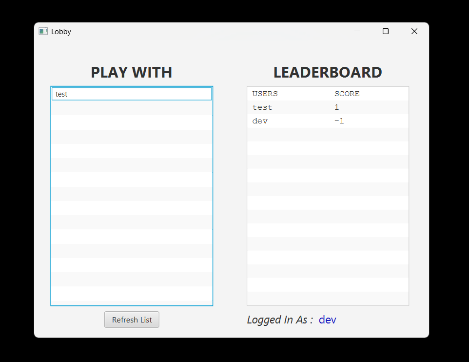
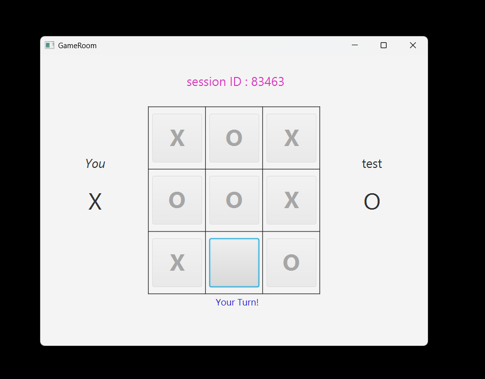

# LAN Tic Tac Toe

A simple LAN-based Tic-Tac-Toe game built in Java — allowing two players on the same network to play a classic 3×3 game.

This project showcases basic networking with web sockets and simple game logic, perfect for learning about client-server communication and turn-based multiplayer games.

---

##  Overview

This is a minimal Java application that enables two players on a local area network to play Tic-Tac-Toe (Noughts and Crosses) against each other. The server manages player connections and relays moves between clients.

---

##  Screenshots

###  Lobby / Connection Screen


###  Gameplay Screen



---

##  Features

- Basic LAN multiplayer gameplay
- Clean and minimal Java implementation
- Simple console / GUI 
- Easy to understand networking logic

---

##  How to Run

1. **Clone the repository:**
   ```bash
   git clone https://github.com/Devashish-Pisal/lan-tic-tac-toe.git
   ```
2. **Build the project:**
   ```bash
   mvn clean install
   ```
3. **Start the server:**
   ```bash
   com.lantictactoe.lantictactoe/Server/GameServer.java
   ```
4. **Start client instances (on same/another machine in the same LAN):**
   ```bash
   com.lantictactoe.lantictactoe/StartClient.java
   ```

---

##  How It Works

- One instance runs as a **server**, accepting connections over a network port.
- Two client instances connect to the server and take turns sending/receiving moves.
- The server broadcasts game state updates to both clients.
- Win/draw logic is evaluated locally by the server.

---

##  Notes

- Ensure all players are on the **same local network**.
- SQLite Database on server machine.

---
